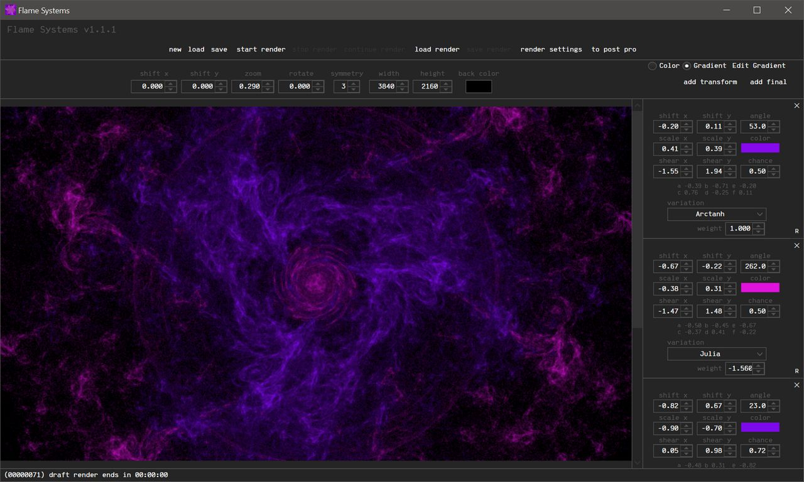
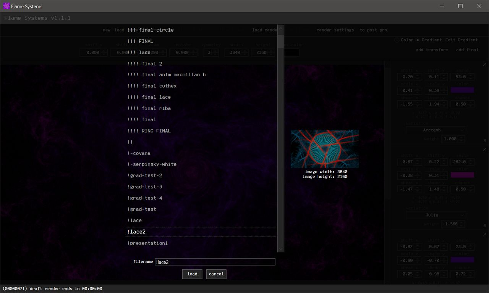
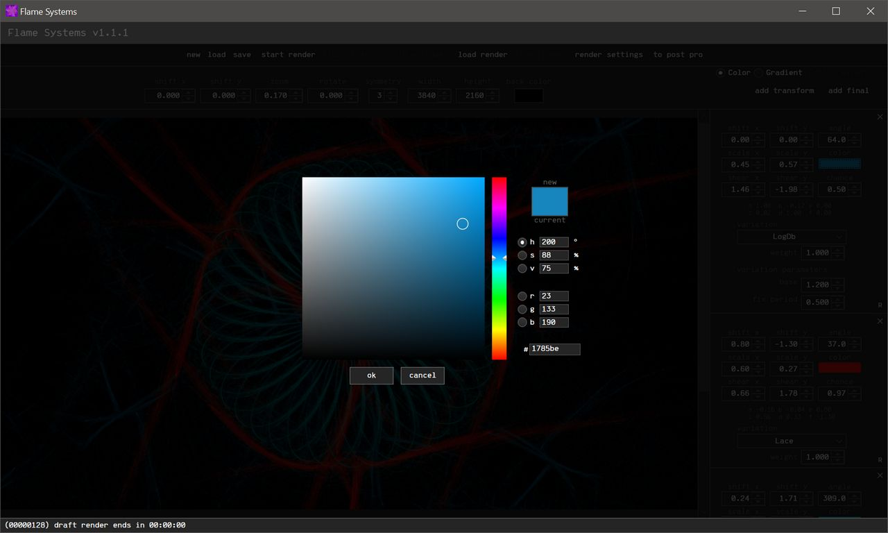
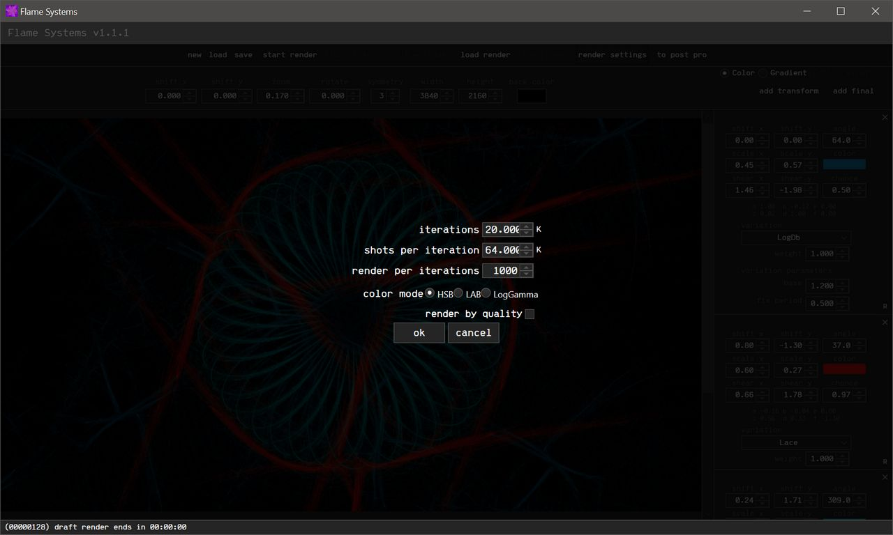

Fractal Flame Systems

My diploma project in STEP Academy.

Windows app for creating fractal flame images. It is not yet complete, but it already has sufficient functionality.

You can create, edit, render and save fractal flames with this application.

App uses .NET Framework 4.7.2

You can view the rendered images gallery and download the latest release [here](https://drive.google.com/drive/folders/1Y0wFxWtkSyBZg-t_Zqu1sXsZEiHiiV3T?usp=sharing) 

